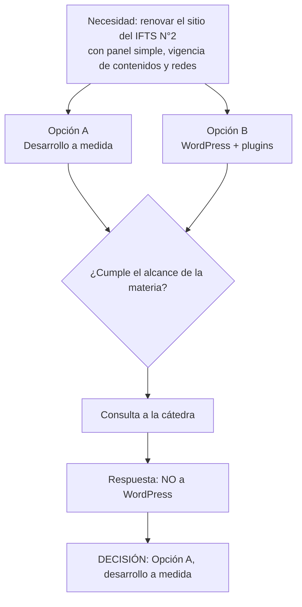

# Registro de decisiones del proyecto

> Bitácora de decisiones (la cátedra la pide como entregable: "registro de decisiones tomadas"). Cada entrada: qué se decidió, quién, por qué y qué descarta. Agregar las nuevas arriba. Los datos que no constan en el repo van como `[completar]`.

---

## D-001 · Desarrollo a medida; WordPress descartado por la cátedra

- **Estado:** cerrada.
- **Fecha:** `[completar]`
- **Decide:** la cátedra (docentes de Desarrollo de Software, IFTS N°29), a consulta del equipo.
- **Contexto:** en la Etapa 1 el equipo planteó dos alternativas: (A) desarrollo a medida de sitio, panel y API; (B) WordPress con plugins como plan B, "pendiente de validar con la cátedra". WordPress ofrecía menos tiempo de implementación y menor costo de mantenimiento, pero menor cobertura de los objetivos de la materia.
- **Decisión:** se va por la **opción A, desarrollo a medida**. **No se usa WordPress ni otro CMS de terceros.**
- **Motivo:** el alcance de la materia (Prácticas Profesionalizantes IV) exige recorrer un ciclo completo de ingeniería de software: diseño, backend, base de datos, seguridad, testing y despliegue propios.
- **Consecuencias:**
  - El stack se define y justifica en la Etapa 2 (Next.js, Node.js/Express, PostgreSQL), sujeto a validación técnica de DevOps.
  - Se asume mayor tiempo de desarrollo y de pruebas; se mitiga con el MVP priorizado en el Figma y con infraestructura gratuita.
  - El riesgo "definición tecnológica custom vs. WordPress sin validar" (Etapa 1) queda **resuelto**.
  - WordPress solo se menciona como referencia de mercado en el análisis de competencia.

Versión gráfica: [diagramas/decision-001-desarrollo-a-medida.png](diagramas/decision-001-desarrollo-a-medida.png) (fuente `.mmd` y `.svg` en la misma carpeta).

---

## D-002 · Canal único con el cliente: Martín Juan (Product Owner)

- **Estado:** cerrada · **Fecha:** `[completar]` · **Decide:** equipo Talento Tech.
- **Decisión:** Martín Juan es el único interlocutor con el IFTS N°2, para no saturar al cliente ni dar respuestas contradictorias con tres grupos en paralelo. Fuente: Etapa 1 y Gestión de Proyectos Parte 1.
- **Aclaración:** Javier Navarro ("Javier N.") pertenece a otro grupo de desarrollo y no es contacto nuestro ni del cliente.

## D-003 · Metodología Scrumban con Trello

- **Estado:** cerrada · **Fecha:** `[completar]` · **Decide:** equipo Talento Tech.
- **Decisión:** sprints livianos alineados a los hitos de semana 2, 6 y 13 más tablero Kanban continuo; Trello como herramienta. Se descartaron Scrum puro (ceremonias fijas no sostenibles con 5 personas sin dedicación exclusiva) y Kanban puro (sin puntos de control). Fuente: Gestión de Proyectos Parte 1.

## D-004 · Nunca se borra contenido: se archiva

- **Estado:** cerrada · **Fecha:** 04/09/2026 · **Decide:** cliente (IFTS N°2), en la reunión de relevamiento.
- **Decisión:** el contenido vencido se oculta o archiva, jamás se elimina de forma automática ni irreversible ("un riesgo grave"). Lo anterior al período vigente se puede borrar solo manualmente.

## D-005 · Redes sociales: selección editorial, de las redes hacia el sitio

- **Estado:** cerrada · **Fecha:** 04/09/2026 · **Decide:** cliente, validado en la reunión.
- **Decisión:** no se replica todo Instagram/Facebook: se etiqueta con un hashtag y el instituto selecciona qué se muestra y por cuánto tiempo. El flujo es redes → sitio; la publicación desde el sitio hacia redes queda fuera de alcance.
- **Pendiente técnico:** validar la integración con la API de Instagram (el Figma lo declara "sujeto a validación técnica"); plan de contingencia: carga manual asistida.

## D-006 · Infraestructura gratuita en la etapa inicial

- **Estado:** cerrada · **Fecha:** 04/09/2026 · **Decide:** cliente (restricción presupuestaria).
- **Decisión:** se priorizan hosting, base de datos y dominio gratuitos; un dominio pago (.com.ar, unos $8.500 ARS/año) o uno .edu.ar se evalúa después con el instituto.

## D-007 · Identidad visual del prototipo: la del IFTS N°2

- **Estado:** vigente (provisoria) · **Fecha:** `[completar]` · **Decide:** equipo, a partir del logo del cliente.
- **Decisión:** el prototipo en Figma usa verde bosque `#123B30`, verde `#087B48`, dorado `#E4BA6E` e Inter. Se ajustará al material de la Agencia de Habilidades cuando el cliente confirme el acceso a su carpeta de marca. El azul `#24507F` es de Talento Tech y no se usa en el sitio del cliente.
